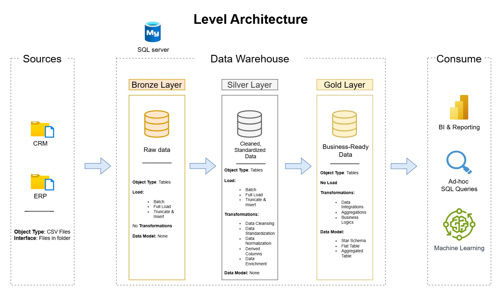

# Data Warehouse and Analytics Project

Welcome to the **Data Warehouse and Analytics Project** repository! 🚀  
This project demonstrates a complete end-to-end solution for data warehousing and analytics, from ingesting raw data to generating actionable business insights. It is designed as a portfolio project to showcase best practices in data engineering and analytics.

---

## 🏗️ Data Architecture

This project follows a **Medallion Architecture** approach with **Bronze**, **Silver**, and **Gold** layers:



1. **Bronze Layer**: Stores raw data exactly as it is received from the source systems (CSV files imported into SQL Server).  
2. **Silver Layer**: Performs data cleaning, standardization, and normalization to prepare the data for analytics.  
3. **Gold Layer**: Contains business-ready data organized in a star schema optimized for reporting and analytics.

---

## 📖 Project Overview

This project covers:

1. **Data Architecture**: Designing a modern data warehouse with Bronze → Silver → Gold layers.  
2. **ETL Pipelines**: Extracting, transforming, and loading data from source systems.  
3. **Data Modeling**: Building fact and dimension tables optimized for analytical queries.  
4. **Analytics & Reporting**: Delivering actionable insights using SQL-based dashboards and reports.  

🎯 This repository is ideal for demonstrating skills in:  
- SQL Development  
- Data Architecture  
- Data Engineering  
- ETL Pipeline Development  
- Data Modeling  
- Data Analytics  

---

## 🛠️ Tools Used

All tools used are freely available:

- **[Datasets](datasets/):** Project datasets (CSV files).  
- **[SQL Server Express](https://www.microsoft.com/en-us/sql-server/sql-server-downloads):** Lightweight relational database server.  
- **[SQL Server Management Studio (SSMS)](https://learn.microsoft.com/en-us/sql/ssms/download-sql-server-management-studio-ssms?view=sql-server-ver16):** GUI for managing SQL Server databases.  
- **[Draw.io](https://www.drawio.com/):** For designing architecture diagrams, data models, and flows.  
- **[Notion Project Steps](https://www.notion.so/Data-Warehouse-Project-2fea273a0c4280ffb475c81996d772ca?source=copy_link):** My personal detailed step-by-step project guide and tasks.
# Note: This project is fully implemented in SQL. No additional programming or Python packages are required.

---

## 🚀 Project Requirements

### Data Warehouse (Data Engineering)

**Objective:** Build a modern data warehouse on SQL Server to consolidate sales and CRM data, enabling accurate and actionable reporting.  

**Specifications:**  
- **Data Sources:** ERP and CRM datasets in CSV format.  
- **Data Quality:** Identify and resolve quality issues before analysis.  
- **Integration:** Combine all sources into a single, consistent data model optimized for analytical queries.  
- **Scope:** Focus on the most recent datasets; historical tracking is not required.  
- **Documentation:** Clear documentation for both business stakeholders and analytics teams.

---

### Analytics & Reporting (Business Intelligence)

**Objective:** Generate SQL-based analytics to provide insights into:  
- Customer behavior  
- Product performance  
- Sales trends  

These insights allow stakeholders to make informed business decisions.  

More details are available in [docs/data_catalog.md](docs/data_catalog.md).

---

## 📂 Repository Structure
```
data-warehouse-project/
│
├── datasets/                           # Raw datasets used for the project (ERP and CRM data)
│   
├── docs/                               # Documentation and diagrams
│   ├── data_catalog.md                 # Metadata and field descriptions for all datasets
│   ├── data_model.drawio               # Draw.io file showing data model architecture
│   ├── data_model.jpg                  # Exported image of the data model
│   ├── dataflow_diagram.drawio         # Draw.io file illustrating ETL/dataflow processes
│   ├── dataflow_diagram.jpg            # Exported image of dataflow
│   ├── integration_model.drawio        # Draw.io file showing integrated data model
│   ├── integration_model.jpg           # Exported image of integrated model
│   ├── naming_conventions.md           # Standard naming rules for tables, columns, files
│   ├── warehouse_architecture.drawio   # Draw.io version of the Medallion Architecture
│   ├── warehouse_architecture.jpg      # Exported image of the architecture diagram
│   ├── requirements.md                 # Detailed project and analytics requirements
│
├── scripts/                            # SQL scripts for ETL and transformations
│   ├── bronze/                         # Scripts for extracting and loading raw data
│   ├── silver/                         # Scripts for cleaning and transforming data
│   ├── gold/                           # Scripts for creating analytical models
│
├── tests/                              # Test scripts and quality files
│
├── README.md                           # Project overview and instructions
└── LICENSE                             # License information for the repository
└── requirements.txt                    # No external dependencies required
```
---

## 🛡️ License

This project is licensed under the [MIT License](LICENSE). You are free to use, modify, and share it with proper attribution.

---

## 🌟 About Me

Hi! I’m **Eduardo Bandeira**, currently a Data Engineering Intern at IBM. I’m passionate about data and enjoy solving real-world problems using data-driven insights.  

Check out my LinkedIn profile:  
[](https://www.linkedin.com/in/eduardo-lupinetti/)

---

## 📌 Acknowledgements

This project is inspired by **DataWithBaraa’s SQL Data Warehouse Project**. His course is one of the best resources I have followed for learning data engineering.  

- **SQL Data Warehouse Project:** [Udemy Course Link](https://www.udemy.com/course/building-a-modern-data-warehouse-data-engineering-bootcamp/?srsltid=AfmBOor7yfr4ZNOF-nmrFt5PS21oMGDD-fzjs1hX-Oo1QhxTkDrKVc0j)  

Thank you checking my project :)


